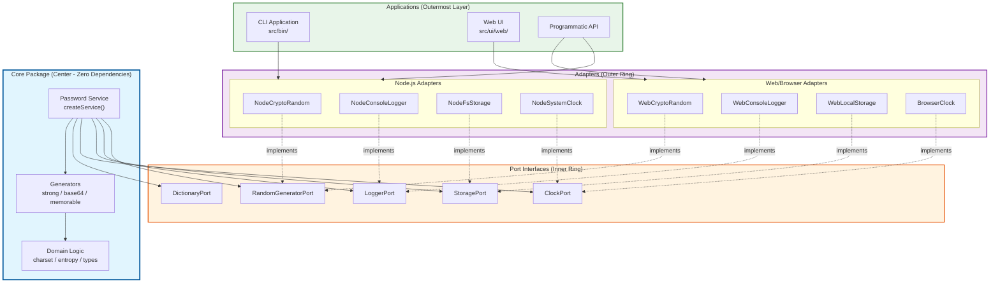

# Password Generator Architecture

## Executive Summary

Password Generator uses **hexagonal architecture** (ports and adapters) to achieve platform independence. The core password generation logic contains no dependencies on Node.js, browser APIs, or any platform-specific code. Port interfaces abstract all external I/O, enabling the same core to run in Node.js CLI, browser, or any JavaScript runtime.

## Architecture Diagram

The following Mermaid diagram illustrates the hexagonal architecture with concentric layers:



### ASCII Diagram (Alternative View)

```
+------------------------------------------------------------------+
|                         Applications                              |
+------------------------------------------------------------------+
|   CLI (src/bin/)    |    Web UI    |    Programmatic API         |
|   - Interactive     |    (future)  |    - import PasswordGen     |
|   - Direct commands |              |    - generatePassword()     |
+------------------------------------------------------------------+
                              |
                              v
+------------------------------------------------------------------+
|                      Adapters (src/adapters/)                     |
+------------------------------------------------------------------+
|  Node Adapters              |  Web Adapters                       |
|  (src/adapters/node/)       |  (src/adapters/web/)                |
|  - NodeCryptoRandom         |  - WebCryptoRandom                  |
|  - NodeConsoleLogger        |  - WebConsoleLogger                 |
|  - NodeFsStorage            |  - WebLocalStorage                  |
|  - NodeSystemClock          |                                     |
+------------------------------------------------------------------+
                              |
                              v (implements)
+------------------------------------------------------------------+
|                    Ports (packages/core/src/ports/)               |
+------------------------------------------------------------------+
|  RandomGeneratorPort  |  LoggerPort  |  StoragePort  |  ClockPort |
|  DictionaryPort       |                                           |
+------------------------------------------------------------------+
                              ^
                              | (depends on)
+------------------------------------------------------------------+
|                    Core (packages/core/)                          |
+------------------------------------------------------------------+
|  Service Layer              |  Generators          |  Domain      |
|  - createService()          |  - strong.js         |  - charset   |
|  - generate()               |  - base64.js         |  - entropy   |
|  - validateConfig()         |  - memorable.js      |  - types     |
|  - calculateEntropy()       |                      |              |
+------------------------------------------------------------------+
```

## Port/Adapter Pattern

### What is a Port?

**Ports** define contracts for external functionality. The core depends only on these contracts, not implementations.

```javascript
// Port interface (packages/core/src/ports/RandomGeneratorPort.js)
export class RandomGeneratorPort {
  async generateRandomBytes(byteLength) {
    throw new Error("Must be implemented");
  }
  async generateRandomInt(max) {
    throw new Error("Must be implemented");
  }
}
```

### What is an Adapter?

**Adapters** implement port interfaces for specific platforms.

```javascript
// Node.js adapter (src/adapters/node/crypto-random.js)
import { randomBytes, randomInt } from "crypto";

export class NodeCryptoRandom extends RandomGeneratorPort {
  async generateRandomBytes(byteLength) {
    return new Uint8Array(randomBytes(byteLength));
  }
  async generateRandomInt(max) {
    return randomInt(max);
  }
}
```

### Available Ports

| Port | Purpose | Required | Default |
|------|---------|----------|---------|
| `RandomGeneratorPort` | Cryptographic randomness | Yes | None |
| `LoggerPort` | Logging operations | No | `NoOpLogger` |
| `StoragePort` | Persistent storage | No | `MemoryStorage` |
| `ClockPort` | Time operations | No | `FixedClock` |
| `DictionaryPort` | Word lists for memorable passwords | No | `MemoryDictionary` |

## Core Package Contract

The `@password-generator/core` package enforces strict isolation rules:

### Forbidden in Core

- **No `crypto` module**: Use `RandomGeneratorPort` instead
- **No `fs` module**: Use `StoragePort` instead
- **No `console`**: Use `LoggerPort` instead
- **No `Date.now()`**: Use `ClockPort` instead
- **No file system operations**: All I/O through ports
- **No network requests**: All external data through ports
- **No `process` object**: Environment-agnostic
- **No DOM APIs**: Platform-independent

### Allowed in Core

- Pure functions for password generation algorithms
- Character set definitions
- Entropy calculations
- Configuration validation
- Error message templates

### Enforcement

Core isolation enforcement relies on:
1. **Parity tests** (`packages/core/test/parity/`) that verify deterministic behavior
2. **CI checks** that detect forbidden imports
3. **Code review** that catches architectural violations

## Decision Records (ADRs)

### ADR-001: Hexagonal Architecture

**Status**: Accepted

**Context**: Password Generator executes in command line, browser, and other environments.

**Decision**: Use hexagonal architecture with ports and adapters.

**Consequences**:
- Test core logic without mocking platform APIs
- Run the same algorithms across all platforms
- Add new platforms by creating new adapters

### ADR-002: Async Port Interfaces

**Status**: Accepted

**Context**: Some implementations (Web Crypto API) operate asynchronously.

**Decision**: All port methods return Promises.

**Consequences**:
- Maintain consistent async/await usage throughout
- Accept slightly more verbose sync implementations
- Achieve maximum platform compatibility

### ADR-003: Required vs Optional Ports

**Status**: Accepted

**Context**: Some ports (random generation) remain essential; others (logging) provide conveniences.

**Decision**: Only `RandomGeneratorPort` remains required. Others use sensible defaults.

**Consequences**:
- Require minimal configuration for basic usage
- Use `createQuickService(randomGenerator)` for the simplest case
- Enable full control when needed

### ADR-004: Parity Testing

**Status**: Accepted

**Context**: Core behavior remains identical across all adapter implementations.

**Decision**: Parity tests define canonical behavior using a deterministic mock random generator.

**Consequences**:
- Update parity tests for any core change
- Provide adapter authors with clear behavioral contracts
- Catch regressions immediately

## Migration Guide

### From Legacy Direct Crypto Usage

**Before** (legacy pattern):
```javascript
import { randomInt } from "crypto";

function generatePassword(length) {
  let password = "";
  for (let i = 0; i < length; i++) {
    password += CHARSET[randomInt(CHARSET.length)];
  }
  return password;
}
```

**After** (hexagonal pattern):
```javascript
import { createService } from "@password-generator/core";
import { NodeCryptoRandom } from "./adapters/node/crypto-random.js";

const service = createService({}, {
  randomGenerator: new NodeCryptoRandom(),
});

const password = await service.generate({
  type: "strong",
  length: 16,
  iteration: 1,
  separator: "",
});
```

### From Direct Function Calls

**Before**:
```javascript
import { generateStrongPassword } from "./lib/strong-password.js";
const password = generateStrongPassword(16);
```

**After**:
```javascript
import { createQuickService } from "@password-generator/core";
import { NodeCryptoRandom } from "./adapters/node/crypto-random.js";

const service = createQuickService(new NodeCryptoRandom());
const password = await service.generate({
  type: "strong",
  length: 16,
  iteration: 1,
  separator: "",
});
```

### Adding Web Support

Use the core in a browser:

```javascript
import { createService } from "@password-generator/core";
import { WebCryptoRandom } from "./adapters/web/WebCryptoRandom.js";

const service = createService({}, {
  randomGenerator: new WebCryptoRandom(),
});

// Same API as Node.js
const password = await service.generate({
  type: "strong",
  length: 16,
  iteration: 1,
  separator: "-",
});
```

## Project Structure

```
password-generator/
├── packages/
│   └── core/                    # Platform-agnostic core
│       ├── src/
│       │   ├── index.js         # Public exports
│       │   ├── service.js       # Service factory
│       │   ├── errors.js        # Error templates
│       │   ├── domain/          # Pure business logic
│       │   │   ├── charset.js
│       │   │   ├── entropy-calculator.js
│       │   │   └── password-types.js
│       │   ├── generators/      # Password generators
│       │   │   ├── strong.js
│       │   │   ├── base64.js
│       │   │   └── memorable.js
│       │   └── ports/           # Port interfaces
│       │       ├── RandomGeneratorPort.js
│       │       ├── LoggerPort.js
│       │       ├── StoragePort.js
│       │       ├── ClockPort.js
│       │       └── DictionaryPort.js
│       └── test/
│           └── parity/          # Behavioral contracts
├── src/
│   ├── adapters/                # Platform adapters
│   │   ├── node/                # Node.js implementations
│   │   └── web/                 # Browser implementations
│   ├── bin/                     # CLI entry point
│   ├── lib/                     # Legacy generators (being migrated)
│   └── services/                # CLI services
├── index.js                     # Main entry point
└── README.md
```

## See Also

- [API Reference](./API.md) - Core package API documentation
- [Contributing Guide](./CONTRIBUTING.md) - Development guidelines
